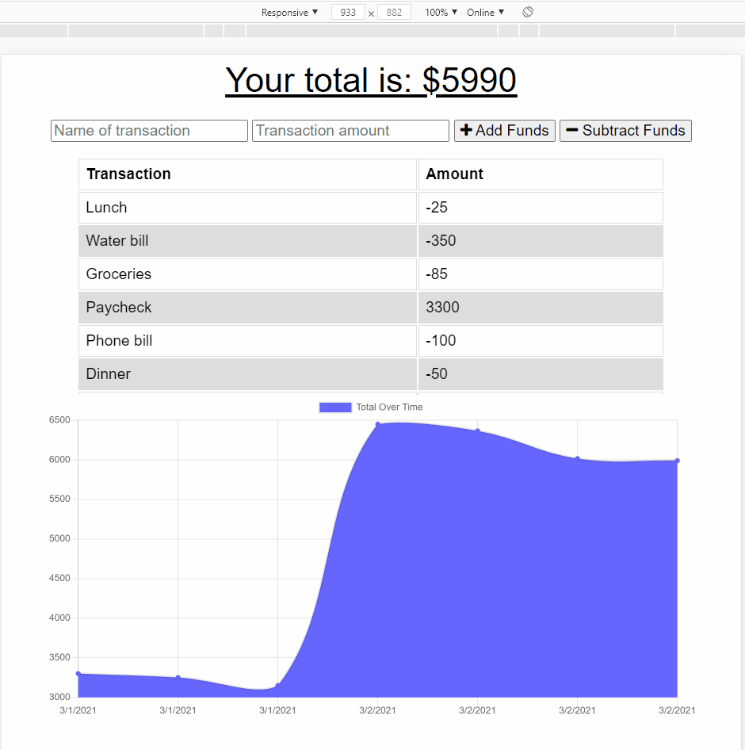

# Bootcamp Homework 18 - PWA: Offline Budget Tracker

## Description
This is a coding bootcamp homework assignment to update existing code for a Budget Tracker to allow for offline access and functionality.  The application allows users to add expenses and deposits to their budget with or without a connection.  When transactions are entered offline, the transactions populate the total when brought back online.  The application code for the Budget Tracker was provided. I added a web manifest, service worker, and IndexedDB to convert this to a Progressive Web Application that is accessible offline.  

## Table of Contents
* [Usage](#Usage)
* [Contributing](#Contributing)
* [Questions](#Questions)
* [License](#License)

## Usage
The [Budget Tracker](https://tranquil-wildwood-98870.herokuapp.com/) application runs in the browser.  The application can be installed on a user's desktop or added to a user's home screen on a mobile device.  

Enter a new expense or deposit.  The app will display the budget balance along with a chart of all transactions.  Transactions can be entered whether a user is online or offline.

## Contributing
Fork the repo and submit a pull request to enhance the code or fix a bug

## Questions
Have questions?  Contact me on [GitHub](https://github.com/thorgriffs) or email <22.kelliking@gmail.com>

## License

[MIT](https://github.com/thorgriffs/pwa-budget-tracker/blob/main/LICENSE) License

Copyright (c) 2021 Kelli King